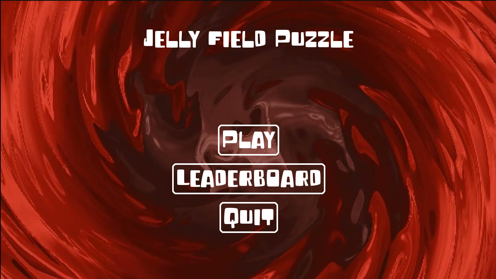
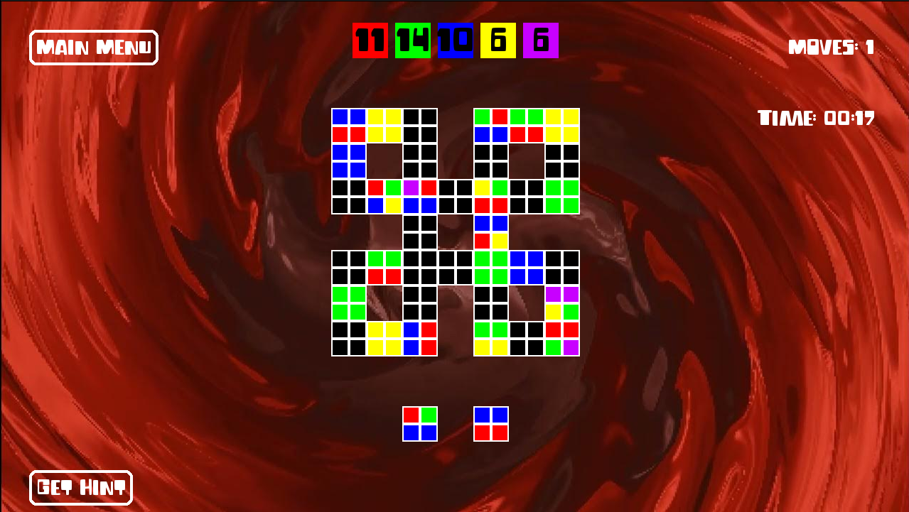

# Jelly Field Game

A puzzle game where you place jellies on a board to make them expand and clear colored jellies.

## Setup

### Install Requirements

```bash
pip install -r requirements.txt
```

## Usage

### Run the Game

```bash
python main.py
```

### Run Tests

```bash
python test.py
```

### Run Analysis

```bash
python analysis.py
```

## Game Mechanics

### State Definition
- **Board**: Matrix of jellies
- **Next Jellies**: Array with the upcoming jellies [Jelly1, Jelly2]
- **Objective Counters**: [C1-NUM, C2-NUM ...] where each element represents remaining jellies of a specific color

> Note: Each jelly is a 2×2 matrix

### Win Condition
All color counters in [C1-NUM, C2-NUM ...] are reduced to 0

### Lose Condition
No space left to place a piece (board filled)

### Operators
1. **Place First Jelly**: Position at (X,Y) if empty and within map boundaries
2. **Place Second Jelly**: Position at (X,Y) if empty and within map boundaries

### State Update Rules
1. After placing a new jelly, all neighboring jellies of the same color are deleted and the placed jelly expands
2. Chain reactions may occur when expansions cause additional matches

### Scoring
Performance is evaluated based on the number of moves required to win the game and the time taken to achieve victory

## Screenshots




